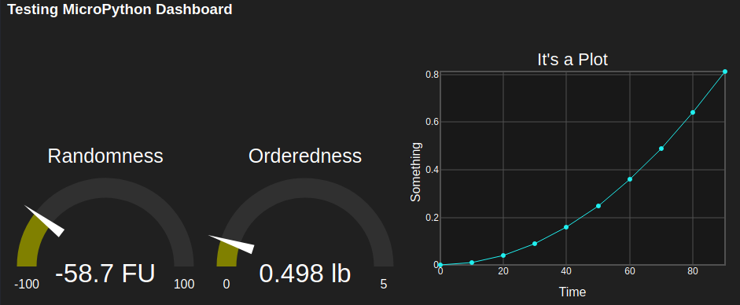

# MicroPyDash

### Why?
Whereas,
* Some of us use small, inexpensive microcontrollers to measure and/or control physical devices;
* It would be nice to use whatever phone, tablet, laptop, or other device is handy as a GUI for such microcontrollers;
* Many microcontrollers which run MicroPython are quite powerful and have networking capability;
* Writing an app to run on many kinds of device is a pain in just about every body part;
* Nearly every device is configured to run a web browser;
* Creating simple web pages with SVG graphics isn't as difficult as it might seem;
* A library to facilitate such creation would make it just plain easy; and
* Nobody seems to have done this for MicroPython in quite the same way, or I just haven't found it...

It has been resolved to attempt to write a GUI library which runs on MicroPython, producing HTML pages directly 
and transmitting those pages through a network interface. 
The "Dashboard" name references the Node-RED Dashboard which was one of the inspirations 
for this projectd and has inspired the style of these widgets to a great degree. 

### It's Not Ready Yet
This project has just been initiated and it's not ready for...well, anything at this time. 
The author will be trying to get a first version going soon though.  
In the meantime, the preview below was drawn by...well, Python on a PC for testing, but it
could just as easily have been drawn by a MicroPython device such as the ESP32 on which
the code is being tested. 

